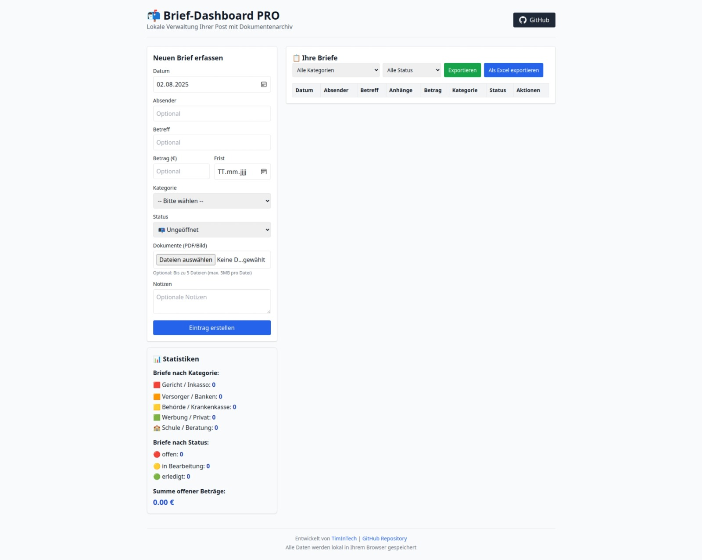

# 📬 Brief-Dashboard PRO



**Lokale Verwaltung Ihrer Post mit Dokumentenarchiv**  
*Entwickelt von [TimInTech](https://github.com/TimInTech)*

## ✨ Funktionen

✅ **Vollständig offline** - Alle Daten bleiben in Ihrem Browser  
✅ **Flexible Erfassung** - Keine Pflichtfelder (außer Datum)  
✅ **Dokumentenarchiv** - PDFs und Bilder direkt anhängen (bis 5MB)  
✅ **Live-Statistiken** - Übersicht nach Kategorien und Beträgen  
✅ **Einfacher Export** - ZIP mit allen Daten + Dokumenten  
✅ **Responsive Design** - Optimiert für Desktop & Mobile  

## 📥 Installation

1. [Repository herunterladen](https://github.com/TimInTech/Brief-Dashboard/archive/main.zip)
2. `index.html` im Browser öffnen
3. Optional: Zu Lesezeichen hinzufügen

```bash
git clone https://github.com/TimInTech/Brief-Dashboard.git
```

## 🖥️ Nutzung

1. **Brief erfassen**:
   - Datum (automatisch vorausgefüllt)
   - Optionale Felder: Absender, Betreff, Betrag, Frist
   - Dokumente anhängen (PDF/JPG/PNG)

2. **Verwalten**:
   - Filter nach Kategorie/Status
   - Status ändern (📭→📖→✅)
   - Dokumente ansehen/löschen

3. **Exportieren**:
   - Komplettarchiv als ZIP (inkl. Anhänge)
   - Automatische Sicherungen im Browser

## 📊 Beispiel-Statistik

```
Briefe nach Kategorie:
🟥 Gericht / Inkasso: 2
🟧 Versorger / Banken: 5  
🟨 Behörde / Krankenkasse: 3
🟩 Werbung / Privat: 10
🏫 Schule / Beratung: 1

Briefe nach Status:
🔴 offen: 7  
🟡 in Bearbeitung: 3  
🟢 erledigt: 11  

Summe offener Beträge: 127,89 €
```

## 💻 Technologie

- **Frontend**: HTML5, CSS3, JavaScript  
- **UI**: [Tailwind CSS](https://tailwindcss.com/)  
- **Export**: [JSZip](https://stuk.github.io/jszip/)  
- **Kompatibilität**: Chrome, Firefox, Edge, Safari  

## 📜 Lizenz

[MIT License](LICENSE) - Open Source und frei nutzbar  

---
